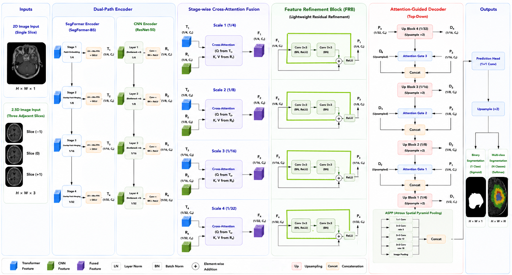

# HSegFormer+

**A Hybrid CNN–Transformer Framework with Stage-wise Cross-Attention for Brain Tumor MRI Segmentation**

This repository accompanies the manuscript **HSegFormer+**, which presents a hybrid CNN–Transformer framework for automatic brain tumor segmentation in magnetic resonance imaging (MRI).

The manuscript is currently under peer review. The source code, pretrained models, and training scripts will be made publicly available after the review process is completed.

---

# Overview

Brain tumor segmentation is an important step in computer-assisted diagnosis, treatment planning, radiotherapy planning, and disease monitoring. However, accurate segmentation remains challenging because of:

- Large variations in tumor size and morphology
- Ambiguous tumor boundaries
- Heterogeneous tumor appearance
- Class imbalance between tumor and background

HSegFormer+ combines convolutional neural networks and vision transformers within a unified encoder–decoder framework to jointly capture local anatomical details and long-range contextual information.

---

# Architecture

The proposed framework consists of the following components:

- **Dual-Path Encoder**
  - SegFormer-B5 Transformer encoder
  - ResNet-50 CNN encoder

- **Stage-wise Cross-Attention Fusion**
  - Progressive feature interaction between CNN and Transformer representations at four encoding stages

- **Feature Refinement Block (FRB)**
  - Lightweight residual refinement of fused features

- **Attention-Guided Decoder**
  - Multi-scale feature reconstruction using attention gates

- **ASPP Module**
  - Multi-scale contextual aggregation before prediction

- **Prediction Head**
  - Supports both binary and multi-class segmentation

For the BraTS 2021 dataset, the framework supports a **2.5D input representation**, while conventional **2D inputs** are used for the Figshare and BRISC 2025 datasets.

---

# Experimental Evaluation

HSegFormer+ has been evaluated on three publicly available brain MRI datasets:

- **BraTS 2021**
- **Figshare Brain Tumor Dataset**
- **BRISC 2025**

The manuscript reports comprehensive quantitative comparisons, ablation studies, qualitative visualizations, and stability analysis.

---

# Research Topics

- Brain tumor MRI segmentation
- Medical image analysis
- Hybrid CNN–Transformer architectures
- Cross-attention feature fusion
- Multi-scale representation learning
- Deep learning for medical imaging

---

# Repository Status

The repository currently contains:

- Project overview
- Network architecture
- Manuscript information

The complete implementation, pretrained weights, and usage examples will be released in a future update.

---

# Citation

If you find this work useful, please cite:

**HSegFormer+: A Hybrid CNN–Transformer Framework with Stage-wise Cross-Attention for Brain Tumor MRI Segmentation**

**Authors**

- Bahar Niknam
- Amirreza Jalili
- Hedieh Sajedi

University of Tehran

*Manuscript under peer review.*

