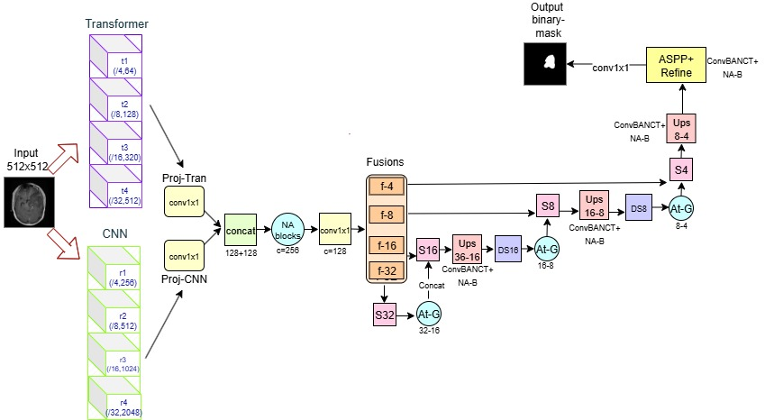

# HSegFormer+

Hybrid CNN–Transformer with Stage-wise Attention for Brain Tumor MRI Segmentation

This repository presents HSegFormer+, a hybrid deep learning framework designed for automatic brain tumor segmentation in contrast-enhanced T1-weighted MRI.

The associated manuscript is currently under blind peer review. Full implementation details, experimental settings, and pretrained weights will be released after publication.

---

# Overview

Accurate brain tumor segmentation plays a critical role in:

Clinical diagnosis

Treatment planning and radiotherapy targeting

Longitudinal tumor monitoring

Quantitative volumetric analysis

However, automatic segmentation remains challenging due to:

Heterogeneous tumor appearance

Low-contrast and fuzzy boundaries

Severe foreground–background class imbalance

Cross-institution imaging variability

HSegFormer+ is designed to address these challenges through a hybrid encoder–decoder architecture that integrates:

Local spatial feature extraction via CNNs

Global contextual modeling via Transformer attention

By combining convolutional and transformer-based representations, the model enhances multi-scale feature learning and improves segmentation performance for complex and heterogeneous tumor regions.

---

# Architecture Overview

  

HSegFormer+ introduces a dual-path hybrid encoder that simultaneously processes input images through:

A convolutional backbone for fine-grained spatial features

A hierarchical transformer backbone for long-range semantic dependencies

The extracted representations are fused across multiple semantic stages and passed into an attention-guided decoder featuring:

Multi-scale feature fusion

Stage-wise attention refinement

Deep supervision for stable optimization

This architectural design enables accurate tumor localization across diverse tumor morphologies, sizes, and contrast conditions.

---

# Research Focus

- Brain tumor MRI segmentation
- Hybrid CNN--Transformer architectures
- Medical image analysis
- Multi-scale representation learning
- Attention-based segmentation models

---

# Repository Status

The repository currently includes:

- Method overview
- Architecture description
- Experimental configuration

The complete implementation and pretrained models will be released in future updates.

---

## Paper

**HSegFormer+: Hybrid CNN--Transformer with Stage-wise Attention for Brain Tumor MRI Segmentation**  
Bahar Niknam, Amirreza Jalili, Hedieh Sajedi  
University of Tehran

*Under review.*

